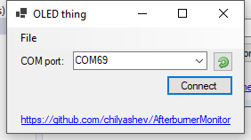

# Afterburner Monitor

This application reads MSI Afterburner's shared memory and sends some stats to an Arduino via a serial port.  
The Arduino project can be found [here](https://github.com/chilyashev/AfterburnerMonitorArduino).

  

## Building

1. Download the project either by cloning the repository or downloading the zip.
2. Open it in Visual Studio.
3. In the Solution Explorer, right click on the "GUIThing" project and set it as a StartUp project
4. Build -> Build Solution
5. Start it and you should be ready to go.

Note: You might have to install [multi-byte support for MFC](https://msdn.microsoft.com/en-us/library/5z097dxa.aspx) in order to build this.  